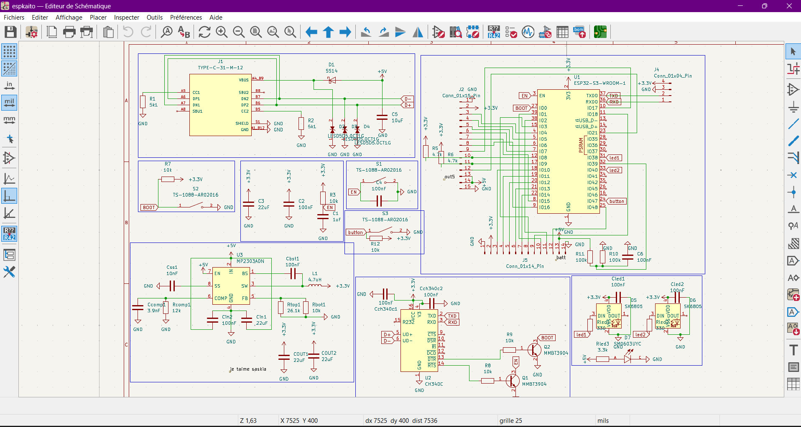

# customesp32devboard
# Custom ESP32-S3 Dev Board (v1)

A custom **ESP32-S3** development board designed to be **reliable**, **good-quality**, and **feature-rich** for **learning + teaching electronics** (power, USB, routing, GPIO, LEDs/buttons, battery monitoring).

---

## Images




---

## Project goals

- Make a **robust ESP32-S3 platform** (clean power + clean layout)
- Break out lots of GPIO for experiments
- Add useful learning features (LEDs, buttons, battery sense, USB programming)
- Be easy to reproduce and improve (v1 → v2)

---

## Key features (v1)

- **ESP32-S3-WROOM-1** module (Wi-Fi + BLE)
- **USB-C** connector
- **CH340C** USB-UART for flashing/serial
- **5V → 3.3V buck converter** (efficient vs linear regulators)
- **Auto-program** support (EN/BOOT control from USB-UART)
- **GPIO headers** for prototyping
- **User button** + indicator LEDs
- **Battery sense divider** (read VBAT on an ADC pin)
- Layout rules applied: antenna keepout, USB routing, buck SW isolation, ground plane

---

## Flashing / serial

- Plug USB-C into your PC
- Select the **CH340** COM port
- Use Arduino IDE or PlatformIO (ESP32-S3 target)

---

## BOM (CSV)

> Exported from KiCad. Parts are intended to be sourced via JLCPCB/LCSC 

```csv
Reference,Qty,Value,Footprint,Notes
C1,1,1uF,Capacitor_SMD:C_0603_1608Metric,Capacitor
"C2,C4,C6,Cbst1,Cch340c1,Cch340c2,Cin2,Cled1,Cled2",9,100nF,Capacitor_SMD:C_0603_1608Metric,Capacitor
"C3,Cin1,COUT1,COUT2",4,22uF,Capacitor_SMD:C_1206_3216Metric,Capacitor
C5,1,10uF,Capacitor_SMD:C_0603_1608Metric,Capacitor
Ccomp1,1,3.9nF,Capacitor_SMD:C_0603_1608Metric,Capacitor
Css1,1,10nF,Capacitor_SMD:C_0603_1608Metric,Capacitor
D1,1,1N5819HW-7-F,Diode_SMD:D_SOD-123,Schottky diode
"D2,D3,D4",3,LESD5D5.0CT1G,LESD5D5.0CT1G:TVS_LESD5D5.0CT1G,ESD/TVS diode
"D5,D6",2,SK6805,LED_SMD:LED_SK6805_PLCC4_2.4x2.7mm_P1.3mm,Addressable RGB LED
D7,1,SM0603UYC,SM0603UYC:LED_SM0603UYC,Indicator LED
J1,1,TYPE-C-31-M-12,TYPE-C-31-M-12:HRO_TYPE-C-31-M-12,USB-C receptacle
J2,1,Conn_01x15_Pin,Connector_PinHeader_2.54mm:PinHeader_1x15_P2.54mm_Vertical,Pin header (hand-solder)
J4,1,Conn_01x04_Pin,Connector_PinHeader_2.54mm:PinHeader_1x04_P2.54mm_Vertical,Pin header (hand-solder)
J5,1,Conn_01x14_Pin,Connector_PinHeader_2.54mm:PinHeader_1x14_P2.54mm_Vertical,Pin header (hand-solder)
L1,1,4.7uH,Inductor_SMD:L_Sunlord_SWPA4012S,Inductor (match footprint)
"Q1,Q2",2,MMBT3904,Package_TO_SOT_SMD:SOT-23,NPN transistor
"R1,R2",2,5k1,Resistor_SMD:R_0603_1608Metric,Resistor
"R3,R7",2,10k,Resistor_SMD:R_0805_2012Metric,Resistor
"R5,R6",2,4.7k,Resistor_SMD:R_0603_1608Metric,Resistor
"R8,R9,R12,Rbot1",4,10k,Resistor_SMD:R_0603_1608Metric,Resistor
"R10,R11",2,100k,Resistor_SMD:R_0603_1608Metric,Resistor
Rcomp1,1,12k,Resistor_SMD:R_0603_1608Metric,Resistor
"Rled1,Rled2",2,330,Resistor_SMD:R_0603_1608Metric,Resistor
Rled3,1,3.3k,Resistor_SMD:R_0603_1608Metric,Resistor
Rtop1,1,26.1k,Resistor_SMD:R_0603_1608Metric,Resistor
"S1,S2,S3",3,TS-1088-AR02016,TS-1088-AR02016:SW_TS-1088-AR02016,Tactile switch
U1,1,ESP32-S3-WROOM-1,RF_Module:ESP32-S3-WROOM-1,ESP32-S3 module
U2,1,CH340C,Package_SO:SOIC-16_3.9x9.9mm_P1.27mm,USB-UART
U3,1,MP2303ADN,Package_SO:SOIC-8-1EP_3.9x4.9mm_P1.27mm_EP2.62x3.51mm,5V->3V3 buck

