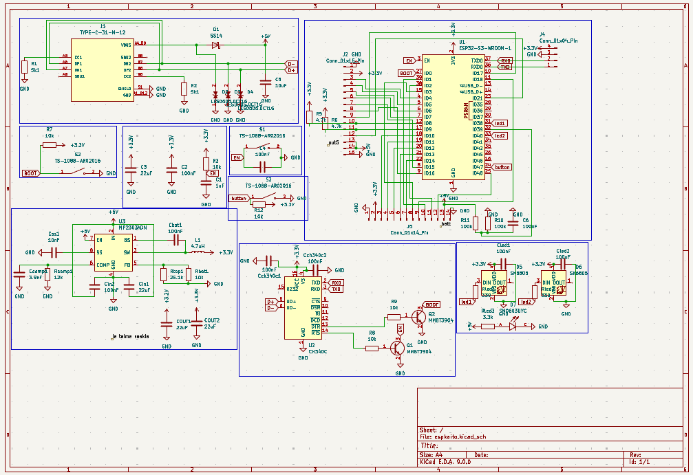
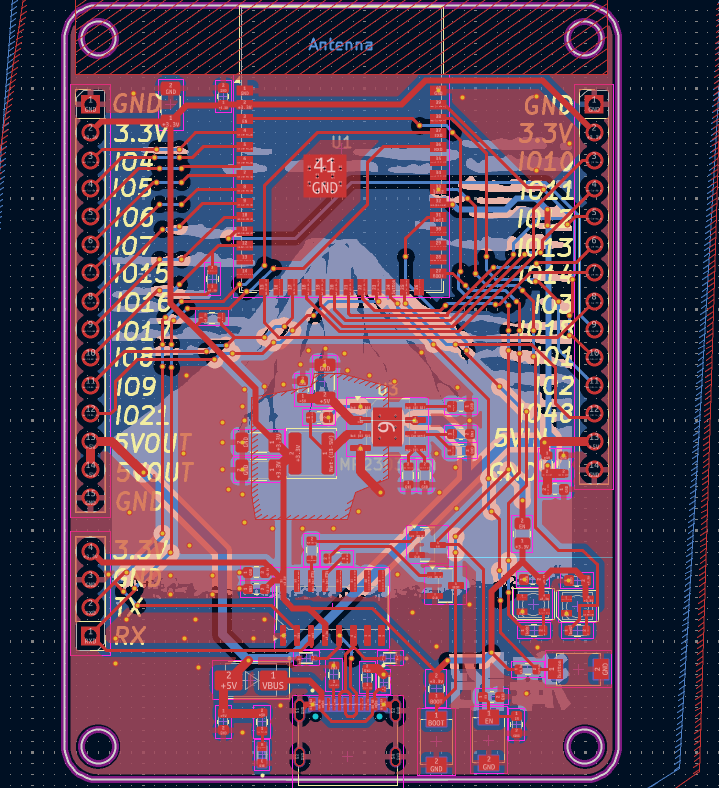
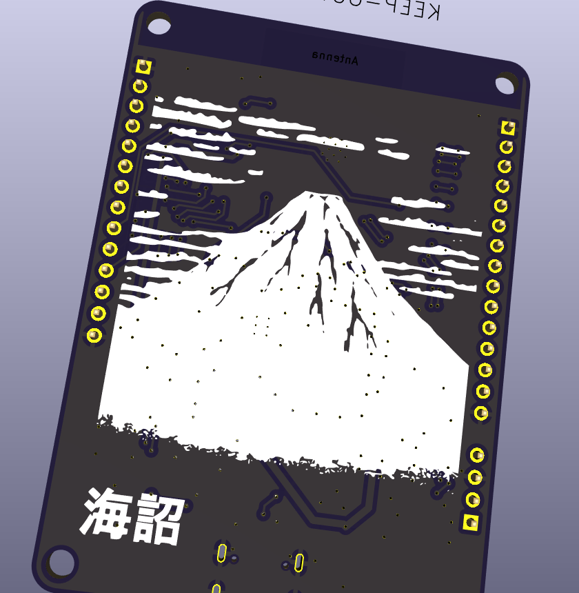

# customesp32devboard
# Custom ESP32-S3 Dev Board (v1)

A custom **ESP32-S3** development board designed to be **reliable**, **good-quality**, and **feature-rich** for **learning + teaching electronics** (power, USB, routing, GPIO, LEDs/buttons, battery monitoring).

---

## Images

---

## Project goals

- Make a **robust ESP32-S3 platform** (clean power + clean layout)
- Break out lots of GPIO for experiments
- Add useful learning features (LEDs, buttons, battery sense, USB programming)
- Be easy to reproduce and improve (v1 → v2)

---

## Key features (v1)

- **ESP32-S3-WROOM-1** module (Wi-Fi + BLE)
- **USB-C** connector
- **CH340C** USB-UART for flashing/serial
- **5V → 3.3V buck converter** (efficient vs linear regulators)
- **Auto-program** support (EN/BOOT control from USB-UART)
- **GPIO headers** for prototyping
- **User button** + indicator LEDs
- **Battery sense divider** (read VBAT on an ADC pin)
- Layout rules applied: antenna keepout, USB routing, buck SW isolation, ground plane

---

## Flashing / serial

- Plug USB-C into your PC
- Select the **CH340** COM port
- Use Arduino IDE or PlatformIO (ESP32-S3 target)

---

## BOM (JLCPCB Assembly Order)

**Build qty:** 5 PCBs (inferred from U1/U2/U3/J1 qty = 5)  
**Parts cost (from JLC export, parts only):** **$60.8676** (assembly + PCB + shipping not included)

Legend: 🟦 Basic | 🟧 Extended | ⚠️ Check

---

<b>MCU</b>

| Designators | Qty | Value | Footprint | LCSC | Manufacturer | Lib | Link | Notes |
|---|---:|---|---|---|---|---|---|---|
| U1 | 5 | ESP32-S3-WROOM-1 | RF_Module:ESP32-S3-WROOM-1 | C2913202 | Espressif Systems | 🟧 | https://jlcpcb.com/partdetail/3198300-ESP32_S3_WROOM_1N16R8/C2913202 | ⚠️ Comment mismatch in export |

<b>USB / Interface</b>

| Designators | Qty | Value | Footprint | LCSC | Manufacturer | Lib | Link | Notes |
|---|---:|---|---|---|---|---|---|---|
| J1 | 5 | TYPE-C-31-M-12 | TYPE-C-31-M-12:HRO_TYPE-C-31-M-12 | C165948 | Korean Hroparts Elec | 🟧 | https://jlcpcb.com/partdetail/Korean_HropartsElec-TYPE_C_31_M12/C165948 |  |
| U2 | 5 | CH340C | Package_SO:SOIC-16_3.9x9.9mm_P1.27mm | C7464026 | WCH(Jiangsu Qin Heng) | 🟧 | https://jlcpcb.com/partdetail/WCH_Jiangsu_Qin_Heng-CH340C/C7464026 |  |
| D2,D3,D4 | 21 | LESD5D5.0CT1G | LESD5D5.0CT1G:TVS_LESD5D5.0CT1G | C5199850 | UMW(Youtai) | 🟧 | https://jlcpcb.com/partdetail/5885882-LESD5D5_0CT1G_UMW/C5199850 | ⚠️ Comment mismatch in export |

<b>Power (Buck)</b>

| Designators | Qty | Value | Footprint | LCSC | Manufacturer | Lib | Link | Notes |
|---|---:|---|---|---|---|---|---|---|
| U3 | 5 | MP2303ADN | Package_SO:SOIC-8-1EP_3.9x4.9mm_P1.27mm_EP2.62x3.51mm | C18876 | Monolithic Power Systems | 🟧 | https://jlcpcb.com/partdetail/19579-MP2303ADN_LFZ/C18876 |  |
| L1 | 9 | 4.7uH | Inductor_SMD:L_Sunlord_SWPA4012S | C316363 | Sunlord | 🟧 | https://jlcpcb.com/partdetail/Sunlord-SWPA4012S4R7MT/C316363 |  |
| D1 | 15 | 1N5819HW-7-F | Diode_SMD:D_SOD-123 | C82544 | Diodes Incorporated | 🟧 | https://jlcpcb.com/partdetail/DiodesIncorporated-1N5819HW_7F/C82544 |  |
| RTOP1 | 20 | 26.1k | Resistor_SMD:R_0603_1608Metric | C325725 | TyoHM | 🟧 | https://jlcpcb.com/partdetail/TyoHM-RMC060326_1K1N/C325725 | ⚠️ Comment mismatch in export |
| RCOMP1 | 20 | 12k | Resistor_SMD:R_0603_1608Metric | C22790 | UNI-ROYAL | 🟦 | https://jlcpcb.com/partdetail/23517-0603WAF1202T5E/C22790 |  |
| CCOMP1 | 20 | 3.9nF | Capacitor_SMD:C_0603_1608Metric | C1618 | FH | 🟧 | https://jlcpcb.com/partdetail/1970-0603B392K500NT/C1618 |  |
| CSS1 | 20 | 10nF | Capacitor_SMD:C_0603_1608Metric | C57112 | FH | 🟦 | https://jlcpcb.com/partdetail/58143-0603B103K500NT/C57112 |  |

<b>Passives (Caps)</b>

| Designators | Qty | Value | Footprint | LCSC | Manufacturer | Lib | Link | Notes |
|---|---:|---|---|---|---|---|---|---|
| C1 | 20 | 1uF | Capacitor_SMD:C_0603_1608Metric | C15849 | Samsung EM | 🟦 | https://jlcpcb.com/partdetail/16531-CL10A105KB8NNNC/C15849 |  |
| C2,C4,C6,CBST1,CCH340C1,CCH340C2,CIN2,CLED1,CLED2 | 55 | 100nF | Capacitor_SMD:C_0603_1608Metric | C14663 | YAGEO | 🟦 | https://jlcpcb.com/partdetail/YAGEO-CC0603KRX7R9BB104/C14663 | ⚠️ “multiple types” warning in export |
| C3,CIN1,COUT1,COUT2 | 24 | 22uF | Capacitor_SMD:C_1206_3216Metric | C12891 | Samsung EM | 🟦 | https://jlcpcb.com/partdetail/13537-CL31A226KAHNNNE/C12891 | ⚠️ “multiple types” warning in export |
| C5 | 20 | 10uF | Capacitor_SMD:C_0603_1608Metric | C19702 | Samsung EM | 🟦 | https://jlcpcb.com/partdetail/20411-CL10A106KP8NNNC/C19702 |  |

<b>Passives (Resistors)</b>

| Designators | Qty | Value | Footprint | LCSC | Manufacturer | Lib | Link | Notes |
|---|---:|---|---|---|---|---|---|---|
| R1,R2 | 20 | 5k1 | Resistor_SMD:R_0603_1608Metric | C23186 | UNI-ROYAL | 🟦 | https://jlcpcb.com/partdetail/23913-0603WAF5101T5E/C23186 | ⚠️ Comment mismatch in export |
| R3,R7 | 20 | 10k | Resistor_SMD:R_0805_2012Metric | C17414 | UNI-ROYAL | 🟦 | https://jlcpcb.com/partdetail/18102-0805W8F1002T5E/C17414 | ⚠️ Comment mismatch in export |
| R5,R6 | 20 | 4.7k | Resistor_SMD:R_0603_1608Metric | C23162 | UNI-ROYAL | 🟦 | https://jlcpcb.com/partdetail/23889-0603WAF4701T5E/C23162 | ⚠️ Comment mismatch in export |
| R8,R9,R12,RBOT1 | 30 | 10k | Resistor_SMD:R_0603_1608Metric | C25804 | UNI-ROYAL | 🟦 | https://jlcpcb.com/partdetail/26547-0603WAF1002T5E/C25804 | ⚠️ Warnings in export |
| R10,R11 | 20 | 100k | Resistor_SMD:R_0603_1608Metric | C25803 | UNI-ROYAL | 🟦 | https://jlcpcb.com/partdetail/26546-0603WAF1003T5E/C25803 | ⚠️ Comment mismatch in export |
| RLED1,RLED2 | 20 | 330R | Resistor_SMD:R_0603_1608Metric | C23138 | UNI-ROYAL | 🟦 | https://jlcpcb.com/partdetail/23865-0603WAF3300T5E/C23138 | ⚠️ Use **330R** in BOM to avoid LED auto-match |
| RLED3 | 20 | 3.3k | Resistor_SMD:R_0603_1608Metric | C22978 | UNI-ROYAL | 🟦 | https://jlcpcb.com/partdetail/23705-0603WAF3301T5E/C22978 |  |

<b>LEDs / Indicators</b>

| Designators | Qty | Value | Footprint | LCSC | Manufacturer | Lib | Link | Notes |
|---|---:|---|---|---|---|---|---|---|
| D5,D6 | 12 | SK6805 | LED_SMD:LED_SK6805_PLCC4_2.4x2.7mm_P1.3mm | C2890035 | OPSCO | 🟧 | https://jlcpcb.com/partdetail/OPSCOOptoelectronics-SK6805EC15/C2890035 | ⚠️ Comment mismatch in export |
| D7 | 20 | SM0603UYC | SM0603UYC:LED_SM0603UYC | C2287 | Hubei KENTO | 🟧 | https://jlcpcb.com/partdetail/Hubei_KENTOElec-KT0603Y/C2287 | ⚠️ Comment mismatch in export |

<b>Discrete / Switches</b>

| Designators | Qty | Value | Footprint | LCSC | Manufacturer | Lib | Link | Notes |
|---|---:|---|---|---|---|---|---|---|
| Q1,Q2 | 15 | MMBT3904 | Package_TO_SOT_SMD:SOT-23 | C7420353 | hongjiacheng | 🟧 | https://jlcpcb.com/partdetail/hongjiacheng-MMBT3904/C7420353 |  |
| S1,S2,S3 | 19 | TS-1088-AR02016 | TS-1088-AR02016:SW_TS-1088-AR02016 | C720477 | XUNPU | 🟦 | https://jlcpcb.com/partdetail/XUNPU-TS_1088AR02016/C720477 |  |

